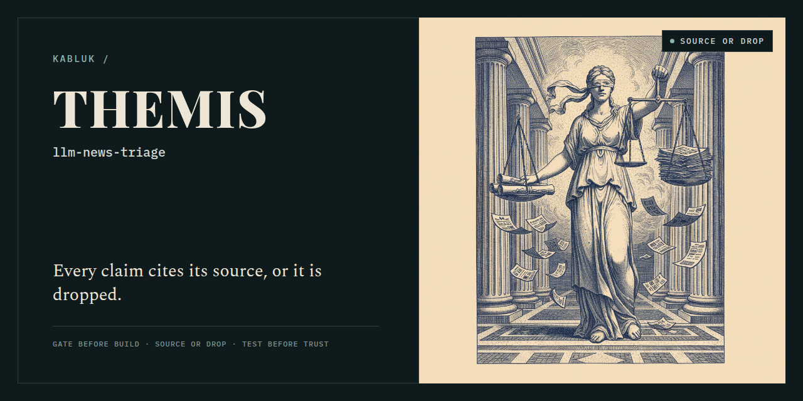
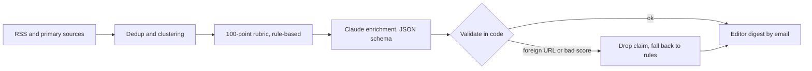

# llm-news-triage



[](https://github.com/kabluk/llm-news-triage/actions/workflows/ci.yml)

Twice-daily news triage on the Claude API with one hard rule:
**every claim the model makes cites a source from its input, or it is dropped.**



## How the model is kept honest

- **Narrow input.** The model sees metadata and short excerpts, never the open web.
- **Schema-constrained output.** Every "established" claim must include a `source_url`.
- **Validation in code.** Claims citing a URL that was not in the input are dropped;
  out-of-range scores fall back to rule-based scoring.
- **"Insufficient data" is always allowed**, so the model is never forced to guess.
- **Optional by design.** Without an API key the pipeline runs on rules alone.

The guards live in [`newstriage/llm.py`](newstriage/llm.py) (`validate`) and are covered by
[`tests/test_llm.py`](tests/test_llm.py) and an end-to-end test that feeds the pipeline a fake
model answer containing an invented URL and an out-of-range score.

## Quick start

```bash
git clone https://github.com/kabluk/llm-news-triage.git
cd llm-news-triage
python -m venv .venv && . .venv/bin/activate
pip install -r requirements.txt

python -m pytest -q                       # 63 tests, no network
python -m newstriage sources --probe      # fetch every enabled feed once, show health
python -m newstriage run --dry-run        # build a digest in out/, send nothing
```

To send email, copy `.env.example` to `.env`, fill in the SMTP variables, then:

```bash
python -m newstriage mail-check           # lists any missing mail settings
python -m newstriage mail-test            # one short test email per recipient
python -m newstriage run --send           # build and send now
python -m newstriage scheduled            # for cron: sends only when a slot is due
```

Repeat sends of the same issue are blocked: each issue is keyed by date and slot.
`scheduled` turns the current time into a key like `2026-10-05-0800` (local time of the
configured timezone, DST-aware), so a cron that fires twice for one slot sends one email.
`--force` overrides the guard for a manual re-send.

Example: the start of a real `run --dry-run` against the shipped feeds on 2026-10-05,
with no API key (rule-based scores only):

```text
[AI triage] 2026-10-05 evening: 5 top, 18 logged [DRY RUN]
Issue 2026-10-05-1700 | prepared 2026-10-05 17:42 EDT | DRY RUN, not emailed
Topic: AI model releases & research
Fetched 255, relevant 200, new 200, duplicates 0; new events 195, updated 0; source errors 0.
Scores are an editorial priority computed by rules, not a probability of truth. Thresholds: >=75 feature; 55-74 editor's call; below that, log only.
LLM enrichment off (no ANTHROPIC_API_KEY): rule-based scores only.

=== TOP EVENTS ===

1. Official announcement: Our approach to EU text provenance rules
   69/100 | editor's call | not marked ready
   - Impact on practitioners: 8/25 | topics: safety, security or policy
   - Primary source: 18/20 | primary source in input (the publisher itself)
   - Novelty: 15/15 | event first seen in this run
   - Reach: 5/15 | 1 independent outlet(s)
   - Freshness: 10/10 | first publication (event date not extracted): 7 h ago
   - Clarity: 13/15 | type: official announcement
   Why it matters: topics: safety, security or policy. 1 independent outlet(s).
   Established:
   * OpenAI News: "Our approach to EU text provenance rules"
     https://openai.com/index/eu-text-provenance
   Unknown:
   * Only one outlet so far: no independent confirmation.
   Event date: not extracted | first published: 2026-10-05
   Document status: official announcement
   Risk of misstatement:
   * No stop flags.
   Primary source: https://openai.com/index/eu-text-provenance (primary source present in input)
   Coverage (1):
   * OpenAI News (2026-10-05): Our approach to EU text provenance rules
     https://openai.com/index/eu-text-provenance
   Angle: What was announced vs. what is available today; who can use it and at what price.
   Next step: Decide whether to feature it; write in your own words with links.
```

## Point it at your own topic

Everything topic-specific lives in three YAML files under `config/`. The Python stays the same.

1. **`config/sources.yaml`**: your feeds. Each entry needs an `id`, `name`, `url`,
   `method: rss` (RSS 2.0 or Atom), a `role` (`primary` if the source publishes the thing itself,
   `reporting` for an outlet covering it, `signal` for an aggregator) and a `relevance` mode
   (`all`, `keywords` or `strong`). Run `python -m newstriage sources --probe` to check them.
2. **`config/rules.yaml`**: what matters.
   - `relevance`: `strong` phrases, `core` + `context` terms and `exclude` phrases for the keyword filter.
   - `doc_types`: how an item becomes "official announcement", "research paper", "media report"...
   - `event_keys`: regexes for strong identifiers (the demo uses arXiv ids) that merge reports of one event.
   - `scoring`: six criteria whose `max` values must sum to 100 (a test checks this).
     `impact.groups` is the main lever: topic groups with points and terms.
   - `flags`: stop-flag vocabularies (strong claims, speculation, PII, number units).
   - `editorial`: the hint texts the digest shows when no LLM is used.
3. **`config/settings.yaml`**: `topic` (shown in the digest and the model prompt), `schedule`
   (timezone and slots), digest limits, HTTP politeness, LLM effort and event cap.

Then run `python -m pytest -q`: the tests in `tests/test_scoring.py`, `test_flags.py` and
`test_dedup.py` use the demo vocabulary, so expect to adapt their example headlines to your topic.

The shipped demo topic is **AI model releases & research**, from seven feeds checked live on
2026-10-05: OpenAI News, Google AI Blog, Google Research Blog, Google DeepMind Blog, Hugging Face
Blog, arXiv cs.CL and MIT News (AI). Anthropic News is listed but disabled: it has no RSS feed.

## Configuration

| Variable | Required | Purpose |
|---|---|---|
| `NEWSTRIAGE_SMTP_HOST` | for sending | SMTP server |
| `NEWSTRIAGE_SMTP_PORT` | for sending | `587` (STARTTLS) or `465` (SSL) |
| `NEWSTRIAGE_SMTP_USER` | for sending | SMTP login |
| `NEWSTRIAGE_SMTP_PASSWORD` | for sending | SMTP password or app password |
| `NEWSTRIAGE_MAIL_FROM` | for sending | Sender address |
| `NEWSTRIAGE_MAIL_TO` | for sending | Recipients, comma-separated |
| `ANTHROPIC_API_KEY` | no | Enables Claude enrichment; without it the pipeline runs on rules alone |
| `NEWSTRIAGE_MODEL` | no | Claude model id, default `claude-sonnet-5-5` |
| `NEWSTRIAGE_CONTACT_EMAIL` | no | Contact shown in the HTTP User-Agent |
| `NEWSTRIAGE_CONFIG_DIR`, `NEWSTRIAGE_DATA_DIR`, `NEWSTRIAGE_OUT_DIR` | no | Paths; default `./config`, `./data` (SQLite), `./out` (digests) |

Variables can live in a `.env` file in the repository root; values already set in the
environment take precedence. Secrets never go into the YAML files.

## How I built this with AI agents

Written with Claude Code from a spec. The tests came first for dedup, scoring and flags;
the agent's code had to pass them. While porting, a test for the `.env` loader caught that
inline comments in `.env.example` were being read into values (the SMTP port became
`587         # 587 = STARTTLS`); the loader now strips them.

## License

MIT
